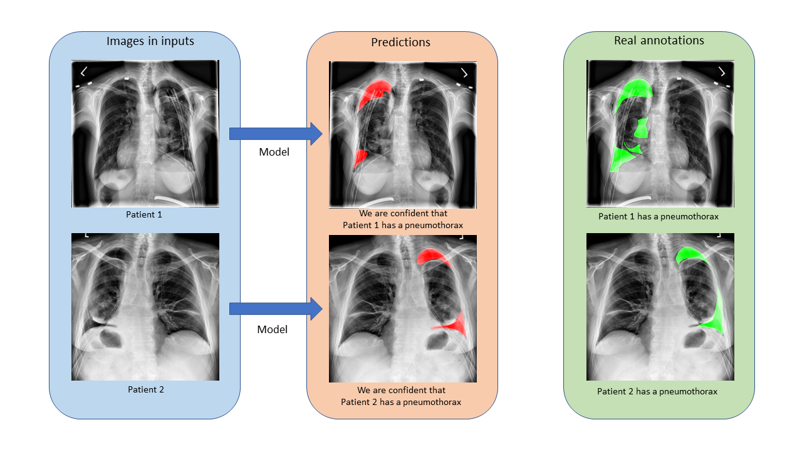
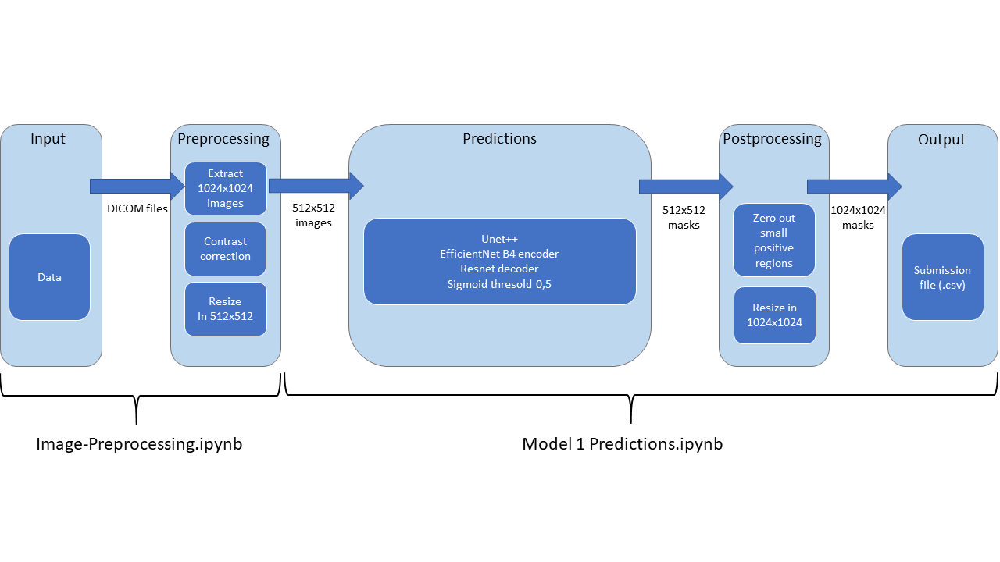

# Pneumothorax-Segmentation

98th (top 7%) Place Solution for [SIM-ACR Pneumothorax Segmentation competition on Kaggle](https://www.kaggle.com/c/siim-acr-pneumothorax-segmentation)
I ranked 98 on 1475 teams during this challenge. I was in a solo team nammed "Noob Noob" and it was my first competition.

My model was an enhanced version of [Unet](https://github.com/zhixuhao/unet) with [EfficientNet B4](https://github.com/qubvel/efficientnet) encoder and Resnet decoder on 512x512 images. My model scored 0.8407 LB on Private Leaderboard and 0.9018 LB on Public Leaderboard.

You can also find the code of an ensembling model that scored 0.8435 LB on Private Leaderboard and 0.8975 LB on Public Leaderboard. I was disturbed by its public LB score and unfortunately i didn't selected it for final score. The ensembling model would have finished 86th instead.

## Flowchart

## Requirements

### Download the weights

Download the corresponding weights and place them in the current folder on the Git repository.

For the single model:
[weights](https://drive.google.com/open?id=1UX2-iHB4eTgE0588kptB8N8kQRTvaG_e)

### Set up the Environment

You will need **Python3** with the following librairies:

- pydicom
- efficientnet
- albumentations
- opencv
- numpy
- pandas
- matplotlib
- tensorflow
- keras
- tqdm
- glob
- shutil
- sklearn
- skimage

Use pip3 to install them.

if you are using Google Collab, you will only have to install pydicom, albumentations and efficientnet.

## Work report

I'm currently writting a work report of what I have done and how I choosed these models. It will be soon avaible.

## Instructions

* Donwload the dataset of the competition: [dataset](https://www.kaggle.com/iafoss/siimacr-pneumothorax-segmentation-data-512) (If you donwload this dataset, you don't have to preprocess the input images will be png images of shape 512x512)
* Download the weights and set up your environment if it hasn't been done (check the specific section above)
* Run the notebook [Model 1 Predictions.ipynb](https://github.com/GuillaumeBalezo/Pneumothorax-Segmentation/blob/master/Model%201%20Predictions.ipynb)

The model needs a quite high GPU memory, so you may reduce the batch size in the "Hyperparameters section" of the notebooks if you have an issue with your GPU memory.
