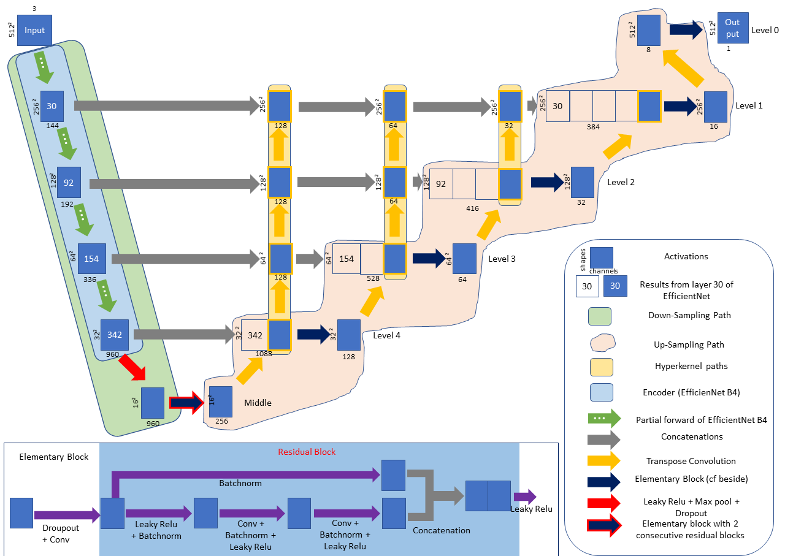

# Pneumothorax-Segmentation

Top 7% Place Solution for [SIM-ACR Pneumothorax Segmentation competition on Kaggle](https://www.kaggle.com/c/siim-acr-pneumothorax-segmentation)

My model was an enhanced version of [Unet](https://github.com/zhixuhao/unet) with [EfficientNet B4](https://github.com/qubvel/efficientnet) encoder and Resnet decoder on 512x512 images. The model scored 0.8413 LB (dice loss) on Private Leaderboard.

You can also find the code of an ensembling model that has a higher score 0.8435 LB on Private Leaderboard.

## Flowchart

## Single Model Architecture

## Requirements

### Download the weights

Download the corresponding weights and place them in the current folder on the Git repository.

For the single model:
[weights](https://drive.google.com/open?id=1UX2-iHB4eTgE0588kptB8N8kQRTvaG_e)

### Set up the Environment

- You will need **Python3** with the following librairies and **Tensorflow v1** (v1.14.x or v.1.15.x works)

- run: pip3 install -r requirements.txt

## Work report

You can have access to my Work Report of this competition in the PDF file Work-report.pdf. You can find here many information about my model.

## Instructions

* Donwload this preprocessed dataset of the competition: [dataset](https://www.kaggle.com/iafoss/siimacr-pneumothorax-segmentation-data-512) 
* Download the weights and set up your environment.
* Run the notebook [pneumothorax_segmentation_model.ipynb](https://github.com/GuillaumeBalezo/Pneumothorax-Segmentation/blob/master/pneumothorax_segmentation_model.ipynb)

You may reduce the batch size in the hyperparameters of the model if you don't have enough GPU memory.
